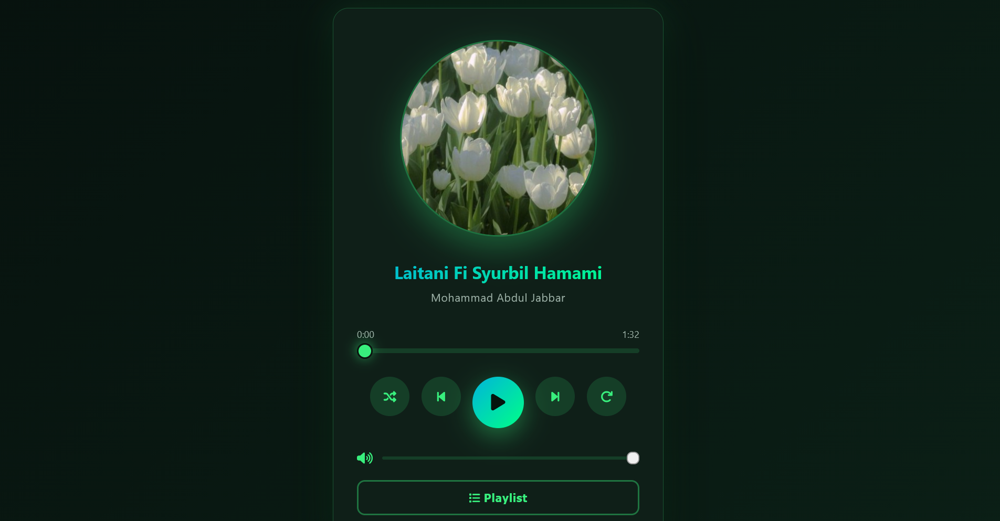
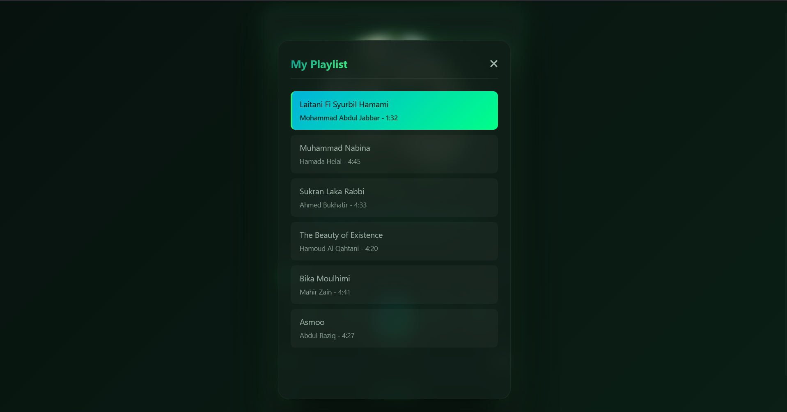

# 🎵 Nasheed Audio Player & Playlist App

A sleek, responsive, and feature-rich **Nasheed Audio Player Web Application** built using **HTML5, CSS3, and Vanilla JavaScript**[cite: 1, 2]. Designed with a dark emerald aesthetic, smooth spinning album art animations, dynamic glassmorphism UI overlay, interactive playlist sidebar, and full keyboard control support[cite: 1, 2, 3].

---

## 🚀 Live Demo & Repository

* 🔗 **Live Demo:** [Click Here to View Live Player](https://farhan-iqbal41.github.io/Nasheed-Playlist-App/)
* 📁 **GitHub Repository:** [Source Code](https://github.com/farhan-iqbal41/Nasheed-Playlist-App)

---

## 📸 Screenshots & Preview

<div align="center">
  
  
</div>

> *Note: Place your screenshot files (`screenshot1.png` and `screenshot2.png`) in the main project folder to display them above.*

---

## ✨ Features

* 🎶 **6 Pre-loaded Nasheeds:** Includes high-quality track metadata with custom album artwork and track durations[cite: 2].
* 💿 **Animated Spinning Album Art:** Visual spinning animation active whenever a track is playing[cite: 3].
* 📜 **Interactive Playlist Drawer:** Smooth glassmorphism modal sidebar listing all available tracks with real-time active highlights[cite: 1, 3].
* 🔀 **Shuffle & Loop Modes:** Full support for repeat-one, repeat-all, and randomized track playback[cite: 1, 2].
* 🔊 **Dynamic Volume Control:** Custom volume slider with real-time icon feedback (mute, low, medium, high) and click-to-mute functionality[cite: 1, 2].
* ⌨️ **Keyboard Shortcut Controls:**
  * **`Spacebar`** ➔ Play / Pause Track[cite: 2]
  * **`Right Arrow (➡️)`** ➔ Skip to Next Track[cite: 2]
  * **`Left Arrow (⬅️)`** ➔ Previous Track / Restart Track[cite: 2]
* 📱 **Modern Emerald UI:** Designed with CSS Grid, Flexbox, custom neon gradients, fluid blur glassmorphism, and smooth scrollbars[cite: 3].

---

## 🎼 Included Nasheeds

1. **Laitani Fi Syurbil Hamami** — *Mohammad Abdul Jabbar*[cite: 2]
2. **Muhammad Nabina** — *Hamada Helal*[cite: 2]
3. **Sukran Laka Rabbi** — *Ahmed Bukhatir*[cite: 2]
4. **The Beauty of Existence** — *Hamoud Al Qahtani*[cite: 2]
5. **Bika Moulhimi** — *Maher Zain*[cite: 2]
6. **Asmoo** — *Abdul Raziq*[cite: 2]

---

## 🛠️ Technologies Used

* **HTML5** — Semantic layout & media structure[cite: 1]
* **CSS3** — Custom properties, CSS animations, Glassmorphism backdrop-filters, Flexbox layout[cite: 3]
* **JavaScript (Vanilla)** — DOM manipulation, Web Audio API event listeners, UI state management[cite: 2]
* **FontAwesome 6.4** — Modern vector icons[cite: 1]

---

## 📁 Project Structure

```text
Nasheed-Playlist-App/
│── index.html            # Main player interface & markup
│── style.css             # Emerald dark theme & animation styles
│── script.js            # Audio engine, controls & playlist logic
│── nasheeds/            # Directory containing MP3 audio files
│   ├── Laitani Fi Syurbil Hamami.mp3
│   ├── Muhammad Nabina.mp3
│   ├── Sukran Laka Rabbi.mp3
│   ├── The Beauty of Existence.mp3
│   ├── Bika Moulhimi.mp3
│   └── Asmoo.mp3
│── screenshot1.png       # Main Player Interface Screenshot
│── screenshot2.png       # Playlist Sidebar View Screenshot
└── README.md             # Documentation